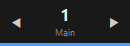
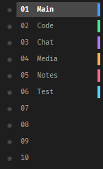
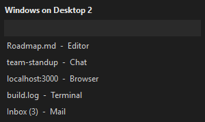
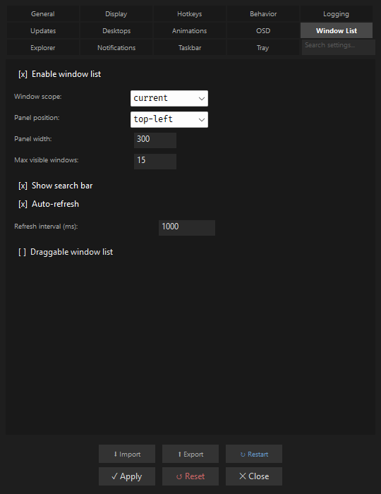

# Everyday Usage

This is the daily-driver guide: the gestures and workflows you actually use once Desk
Switcheroo is running. It ties together the widget, the desktop list, the window list,
hotkeys, and the tray menu, and points you at the deeper guides for mechanics. If you have
not installed it yet, start with [Getting Started](../getting-started.md); for a
plain-language account of what a switch does under the hood, see
[How It Works](../how-it-works.md).

The behavior of every interaction here is configurable. This page names the interaction and
links onward; the exact INI keys, defaults, and ranges live in the
[Advanced INI Reference](../configuration/ini-reference.md), and the underlying mechanics are
covered in [Desktop Management](desktop-management.md), [Coloring & Theming](coloring.md),
and [Persistence & Profiles](persistence.md).

## The widget

The widget is the small always-on-top overlay docked to your taskbar (bottom-left by
default). It shows the current desktop number, its label, an accent color bar, and left/right
navigation arrows (`desktop_switcher.au3`). It is the hub for everything:

- **Click an arrow** to step to the previous or next desktop. The next arrow honors your
  wrap and auto-create options (see [Navigation options](desktop-management.md#navigation-options)).
- **Click the number** to open or close the [desktop list panel](#the-desktop-list). If quick
  access is enabled, a *double* click on the number opens the [quick-access input](#quick-access-jumping)
  instead.
- **Scroll the wheel over the widget** to switch desktops, when `scroll_enabled` is on in the
  `[Scroll]` section. `scroll_direction` flips the direction and `scroll_wrap` controls
  wrapping past the ends.
- **Drag the widget** to reposition it; the position persists so it stays where you put it.
- **Right-click the widget** for its context menu (`includes/ContextMenu.au3`): rename the
  current desktop, add a desktop, keep the desktop list open (pin), toggle carousel mode,
  open **Settings**, open **About**, and **Quit**, among other actions. Which items appear
  depends on which features you have enabled.

*The widget is the hub: arrows switch desktops, the number opens the list, and right-click opens the menu.*

If another always-on-top window ever buries the widget, it re-asserts itself on top on its
own; see [Stability & Mitigations](../reference/stability.md) for how that watchdog works.

## The desktop list

Click the widget number (or press the toggle-list hotkey, default `Ctrl+Alt+Down`) to open
the **desktop list** — the popup panel showing every desktop. Day to day you will:

*The desktop list: click to switch, right-click a row for actions, drag to reorder.*

- **Click a row** to switch to that desktop.
- **Right-click a row** for per-desktop actions — Switch, Rename, Peek, Set Color, Move Here
  (the active window), Add Desktop, and Delete. Delete is shown in red and asks for
  confirmation first by default.
- **Pin the panel open** (from the widget menu's "keep list open", or `desktop_list_pinned`)
  when you want it to stay visible while you work. While pinned it ignores auto-hide and the
  widget number no longer toggles it.
- **Drag a row** to reorder desktops. Because Windows has no API to move a desktop, the app
  reorders by swapping neighbors in a chain — the full mechanics are in
  [Reordering desktops](desktop-management.md#reordering-desktops-drag).

When the panel is not pinned, it auto-hides shortly after your cursor leaves it. Scrolling,
keyboard navigation, and the count limits are all covered in
[Desktop Management](desktop-management.md#the-desktop-list-panel).

## The window list

The window list is a separate panel that shows the windows on the current desktop
(`includes/WindowList.au3`). Toggle it with `hotkey_toggle_window_list` (default
`Ctrl+Alt+W`). It is the tool for wrangling *windows* rather than desktops, and it has grown
a full set of management gestures:

*The window list shows every window on the current desktop; a search box filters by title.*

Its width, position, search box, and refresh behavior are set on the Window List tab in Settings:

*The Window List tab configures the panel's placement, size, and behavior.*

- **Click a window row** to focus that window.
- **Search** — type in the search box at the top to filter the list by window title
  (case-insensitive); enable or hide the box with the "Show search bar" setting on the
  Window List tab.
- **Drag the title bar** to move the panel; the position persists across sessions
  (`_WL_ProcessDrag`). Enable dragging with `window_list_draggable`.
- **Pin the panel** so it stays open (from the title-bar menu below, or `window_list_pinned`).

### Per-window actions (right-click a row)

Right-clicking a window row opens a menu whose items adapt to that window's state
(`_WL_CtxShow`):

- **Send to Desktop** — a submenu to move the window to any desktop, or to the next, previous,
  or a brand-new desktop.
- **Go to Desktop N / Pull to Current** — when the window lives on another desktop, jump to it
  or pull it onto the current one.
- **Minimize / Maximize / Restore** — whichever apply.
- **Always on Top** — toggles the window's topmost state (`_WL_ToggleAlwaysOnTop`). This is
  best-effort and needs no administrator rights; from a normal process Windows silently
  ignores the change on elevated windows, so the app verifies the change actually took before
  claiming success.
- **Pin window / Pin app** — when pinning is enabled, keep the window (or the whole app) on
  every desktop.
- **Close** — closes the window gracefully.

### Whole-desktop actions (right-click the title bar)

Right-clicking the window list's **title bar** opens a second menu that acts on every window
the panel is showing (`_WL_TitleCtxShow`):

- **Pin / Unpin** the panel, **Refresh** it, and **Close** it.
- **Send All to Desktop** — move every listed window to the next, previous, a new, or a chosen
  desktop in one action (`_WL_SendAllToDesktop`).
- **Minimize All** and **Maximize All** (`_WL_MinimizeAll`, `_WL_MaximizeAll`).
- **Close All** — shown in red; closes each window gracefully with `WinClose` (never a forced
  process kill), so apps can still prompt to save unsaved work.

These "all-window" actions are what make the window list a fast way to clear or relocate a
whole desktop's worth of windows at once.

## Hotkey-driven use

If you prefer to keep your hands on the keyboard, almost everything above has a global
hotkey. The defaults that ship enabled:

| Action | Default hotkey | Key |
|---|---|---|
| Next / previous desktop | `Ctrl+Alt+Right` / `Left` | `hotkey_next` / `hotkey_prev` |
| Jump back to last desktop | `Ctrl+Alt+Tab` | `hotkey_toggle_last` |
| Open the desktop list | `Ctrl+Alt+Down` | `hotkey_toggle_list` |
| Open the window list | `Ctrl+Alt+W` | `hotkey_toggle_window_list` |
| Rename current desktop | `Ctrl+Alt+R` | `hotkey_rename_desktop` |
| Add a desktop | `Ctrl+Alt+Insert` | `hotkey_add_desktop` |
| Move active window + follow | `Ctrl+Alt+Shift+Right` / `Left` | `hotkey_move_follow_next` / `_prev` |
| Send active window to a new desktop | `Ctrl+Alt+N` | `hotkey_send_new_desktop` |
| Open Settings | `Ctrl+Alt+S` | `hotkey_open_settings` |

Jump-to-desktop hotkeys (`hotkey_desktop_1` through `hotkey_desktop_9`) and several others
(delete desktop, toggle carousel, load profiles) ship *unbound* — set them in Settings or the
INI. The complete list with every default chord is in the
[Advanced INI Reference](../configuration/ini-reference.md).

## Quick access (jumping)

With `quick_access_enabled` on, double-click the widget number to open a small **quick-access
input** (`_QuickAccess_Show`), type a desktop number, and jump straight there. It is the
fastest way to reach a specific desktop when you have more than a handful and do not want to
scan the full list.

## Peek

**Peek** lets you glance at another desktop and bounce back automatically
(`includes/Peek.au3`). Start a peek (for example from a desktop row's "Peek") and the app
switches you there while remembering where you came from; when you leave, a short timer snaps
you back. If you decide to stay, the peek can be committed so the peeked desktop becomes the
active one. Full behavior is in [Peeking at a desktop](desktop-management.md#peeking-at-a-desktop).

## Carousel mode

Carousel mode cycles through your desktops automatically on a timer — handy for dashboards or
a rotating display. Enable it with `carousel_enabled` and set the dwell time with
`carousel_interval` (default 20 seconds). Toggle it from the tray/context menu or a hotkey;
it shows a toast when toggled unless you turn that off. See
[Carousel mode](desktop-management.md#carousel-mode) for the details.

## Finding a setting (Settings search)

The **Settings** dialog (right-click the widget → Settings, or `Ctrl+Alt+S`) has 14 tabs, so
it includes a **search box** in its top-right chrome to find any setting by keyword. As you
type, a results panel drops over the content area (`__CD_BuildSearchUI`):

- Each result is a **two-line row**: the first line is the tab path (`Tab › Sub-tab ›
  Setting`), and the second, dimmer line is a short description pulled from the setting's own
  tooltip. If a description is truncated, hovering the row shows the full text.
- The header shows a live match count (or "No settings match").
- **Click a result** to jump straight to its tab and sub-tab; the target control briefly
  flashes so you can spot it (`__CD_SearchNavigate`).
- The results stay open while you move the mouse and only close when you clear the box or
  click somewhere that is a genuine click-away, so a stray mouse movement never dismisses them.

Search matches against both the setting's label and its tooltip text, so you can find things
by what they do, not just their exact name.

## The tray menu

Right-clicking the Desk Switcheroo **tray icon** gives you a menu that mirrors the most common
actions without needing the widget in view (`desktop_switcher.au3`): **Show Desktop List**,
**Rename Desktop**, **Add Desktop**, **Delete Desktop**, a **Switch to Desktop** submenu, a
**Move Window to** submenu, **Toggle Carousel**, **Settings**, **About**, and **Quit**. Which
items appear depends on which features you have enabled (for example the carousel item only
shows when `carousel_show_in_menu` is on). In tray-only mode, where the widget is hidden, this
menu is your primary control surface.

## A worked workflow: a project per desktop

A common way to live in Desk Switcheroo is one desktop per context. Here is the end-to-end
flow using the gestures above:

1. **Create and name the desktops.** Add desktops from the widget menu or `Ctrl+Alt+Insert`,
   then rename each one (`Ctrl+Alt+R` or right-click → Rename) to something like *Work*,
   *Comms*, *Research*. On Windows 11 those names also show up in Task View, because labels
   sync with the OS desktop names.
2. **Color-code them.** Right-click a desktop row → Set Color to give each a distinct accent;
   the color shows in the list and on the widget's color bar, so you always know where you
   are. See [Coloring & Theming](coloring.md) for per-desktop colors and wallpapers.
3. **Sort your windows onto them.** Open the window list (`Ctrl+Alt+W`) on a busy desktop and
   use **Send to Desktop** per window, or the title bar's **Send All to Desktop**, to sweep a
   whole desktop's windows onto the right one. Pin any window you always want with you (a chat
   app, say) to *All Desktops*.
4. **Make the layout stick.** Turn on session restore so your windows return to the right
   desktops after a reboot, and save the whole arrangement as a **profile** you can reload
   later. Both are covered in [Persistence & Profiles](persistence.md).
5. **Move around fast.** Switch with `Ctrl+Alt+Right`/`Left`, wheel-scroll over the widget, or
   double-click the number and type a desktop number to jump. Use `Ctrl+Alt+Tab` to bounce
   back to where you just were.
6. **Automate the boring parts.** Add a window rule so a given app always lands on its desktop
   automatically, or a hook that runs a script on desktop change. See
   [Rules Engine & Hooks](rules-engine.md).

## Related pages

- [Desktop Management](desktop-management.md) — the mechanics behind every gesture here.
- [Coloring & Theming](coloring.md) — themes, per-desktop accent colors, and wallpapers.
- [Persistence & Profiles](persistence.md) — session restore, labels, and profiles.
- [Rules Engine & Hooks](rules-engine.md) — automate window placement and run scripts on events.
- [Configuration](../configuration/index.md) — the Settings dialog and how settings apply.
- [Advanced INI Reference](../configuration/ini-reference.md) — every key named on this page.
