# Interface Tour

This page is a guided, picture-by-picture tour of every surface Desk Switcheroo puts on
screen — the widget, its panels, every menu, the Settings dialog tab by tab, and the small
overlays. For each one you get a screenshot, an element-by-element walkthrough of what you are
looking at, and links to the guide that covers it in depth.

If you just want to get running, start with [Getting Started](getting-started.md); for what
happens under the hood when you switch, see [How It Works](how-it-works.md). This page is the
reference for *recognising* each piece of UI and knowing what every part does.

> Screenshots use the default **dark** theme with sample desktops labeled *Main, Code, Chat,
> Media, Notes, Test* and per-desktop accent colors, so the components look the way they will
> once you have set yours up. The window list shows placeholder windows for illustration.

## On this page

- [The taskbar widget](#the-taskbar-widget)
- [The desktop list panel](#the-desktop-list-panel)
- [The desktop context menu](#the-desktop-context-menu)
- [The rename dialog](#the-rename-dialog)
- [The window list panel](#the-window-list-panel)
- [Window list — per-window menu](#window-list--per-window-menu)
- [Window list — title-bar menu](#window-list--title-bar-menu)
- [The color picker](#the-color-picker)
- [The on-screen display (OSD)](#the-on-screen-display-osd)
- [Toast notifications](#toast-notifications)
- [The Settings dialog](#the-settings-dialog)
  - [General tab](#settings-general-tab) · [Display tab](#settings-display-tab) ·
    [Hotkeys tab](#settings-hotkeys-tab) · [Behavior tab](#settings-behavior-tab) ·
    [Desktops tab](#settings-desktops-tab) · [Window List tab](#settings-window-list-tab) ·
    [Notifications tab](#settings-notifications-tab) · [OSD tab](#settings-osd-tab) ·
    [Settings search](#settings-search)
- [Update-check dialogs](#update-check-dialogs)
- [Tray menu](#tray-menu) *(text only)*
- [Crash dialog](#crash-dialog) *(text only)*

---

## The taskbar widget

**What you're seeing.** The widget is the small always-on-top overlay that docks to your
taskbar (bottom-left by default). Left to right and top to bottom it has four visible parts:

- **Left arrow (◀)** — switches to the *previous* desktop. It highlights when you hover it.
- **Desktop number** — the large bold number is the current desktop's index. A single
  **click** opens or closes the [desktop list](#the-desktop-list-panel); a **double-click**
  opens the quick-access number input when that is enabled.
- **Desktop label** — the smaller text under the number (`Main` here) is the current desktop's
  custom name. It is blank if the desktop has no label.
- **Right arrow (▶)** — switches to the *next* desktop, honoring your wrap / auto-create
  options.
- **Accent color bar** — the thin colored strip along the bottom edge reflects the *current*
  desktop's accent color (blue for desktop 1 here). It falls back to the theme background when
  the desktop has no color or the bar is disabled.

Other gestures that do not change its appearance: **scroll** the wheel over the widget to
switch desktops (when enabled), **drag** it to reposition (when enabled), and **right-click**
it to open the [context menu](#the-desktop-context-menu). If another always-on-top window
buries it, it re-asserts itself on top automatically.

**Where to configure / learn more.** Position, offsets, dragging, dimensions, the color bar,
and the count display are all on the [General](#settings-general-tab) and
[Display](#settings-display-tab) Settings tabs. Full gesture list:
[Desktop Management](guides/desktop-management.md#the-widget). Color bar:
[Coloring & Theming](guides/coloring.md#per-desktop-accent-colors).

---

## The desktop list panel

**What you're seeing.** Clicking the widget number (or the toggle-list hotkey, default
`Ctrl+Alt+Down`) opens this popup listing every virtual desktop. Each **row** has:

- **A zero-padded number** (`01`, `02`, …) on the left — the desktop index.
- **The desktop label** (`Main`, `Code`, `Chat`, …) — empty rows (07–10 here) are desktops
  with no custom name.
- **An accent color bar** at the right edge, shown only for desktops that have a color set.

**Click a row** to switch to that desktop; **right-click a row** for the
[per-desktop actions menu](#the-desktop-context-menu). When you have more desktops than fit,
scroll arrows appear at the top and bottom and the list becomes scrollable. The panel
**auto-hides** shortly after your cursor leaves it unless you pin it open.

**Where to configure / learn more.** Row count, scrolling, numbering, and keyboard navigation
are on the [Display](#settings-display-tab) tab and in `[General]`/`[Display]` of the
[INI reference](configuration/ini-reference.md). Full behavior:
[Desktop Management](guides/desktop-management.md#the-desktop-list-panel).

---

## The desktop context menu

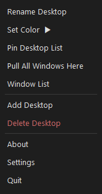

**What you're seeing.** Right-clicking the widget (or a desktop row) opens this menu, anchored
at the cursor. Its entries, top to bottom:

- **Rename Desktop** — opens the [rename dialog](#the-rename-dialog) for the current desktop.
- **Set Color ▶** — a submenu (the [color picker](#the-color-picker)) for the desktop's accent
  color. The ▶ marks it as expandable.
- **Pin Desktop List** — keeps the desktop list panel open instead of auto-hiding.
- **Pull All Windows Here** — gathers windows from other desktops onto the current one.
- **Window List** — toggles the [window list panel](#the-window-list-panel).
- **Add Desktop** — creates a new virtual desktop.
- **Delete Desktop** — removes the current desktop. It is drawn in **red** because it is
  destructive, and asks for confirmation first by default.
- **About** / **Settings** / **Quit** — open the About box, open the
  [Settings dialog](#the-settings-dialog), and exit the app.

Which items appear depends on which features you have enabled (for example *Set Color* only
shows when per-desktop colors are on). The **tray menu** mirrors these entries.

**Where to configure / learn more.**
[Desktop Management](guides/desktop-management.md#the-desktop-list-panel) covers each action;
tray-menu contents are set on the [Tray] tab (see [Configuration](configuration/index.md)).

---

## The rename dialog

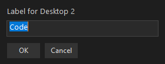

**What you're seeing.** A small modal for naming a desktop, reached from *Rename Desktop* in
the menus or the rename hotkey (default `Ctrl+Alt+R`). It has:

- **A title** — `Label for Desktop 2` names which desktop you are editing.
- **A text input** — pre-filled with the desktop's current label (`Code`), with the text
  selected so you can type over it immediately.
- **OK** — saves the new label; **Cancel** (or `Esc`) discards it.

Labels are stored in `desktop_labels.ini`; on Windows 11 they also sync with the OS desktop
names, so a rename here shows up in Task View and vice versa.

**Where to configure / learn more.**
[Desktop Management](guides/desktop-management.md#renaming-desktops-and-labels) and
[Persistence & Profiles](guides/persistence.md#desktop-labels).

---

## The window list panel

**What you're seeing.** A separate panel that lists the windows on the current desktop, toggled
with `Ctrl+Alt+W`. From top to bottom:

- **Title bar** — `Windows on Desktop 2` names the desktop whose windows are shown. It doubles
  as the **drag handle** (when dragging is enabled) and its **right-click** opens the
  [title-bar menu](#window-list--title-bar-menu).
- **Search box** — the dark input row under the title filters the list by window title as you
  type (case-insensitive). It can be hidden.
- **Window rows** — one per window (`Roadmap.md — Editor`, `team-standup — Chat`, …).
  **Click a row** to focus that window; **right-click a row** for the
  [per-window menu](#window-list--per-window-menu).

When there are more windows than fit, the list scrolls. The panel's position persists across
sessions.

**Where to configure / learn more.** Placement, width, scope, search, and refresh are on the
[Window List](#settings-window-list-tab) tab. Full walkthrough:
[Desktop Management](guides/desktop-management.md#the-window-list-panel).

---

## Window list — per-window menu

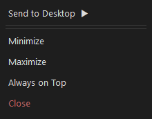

**What you're seeing.** Right-clicking a single window row opens actions that apply to *that
one window*, adapting to its current state:

- **Send to Desktop ▶** — a submenu to move the window to any desktop, or the next / previous /
  a brand-new one.
- **Minimize** / **Maximize** — (and **Restore**, when applicable) change the window state.
- **Always on Top** — toggles the window's topmost flag. This is best-effort and needs **no
  administrator rights**; on elevated windows Windows silently ignores the change, so the app
  verifies it actually took effect before reporting success.
- **Close** — closes the window gracefully (drawn in red as the destructive entry); the app
  never force-kills a process, so the app can still prompt to save.

A *Pin window / Pin app* entry also appears here when window pinning is enabled.

**Where to configure / learn more.**
[Desktop Management](guides/desktop-management.md#per-window-actions).

---

## Window list — title-bar menu

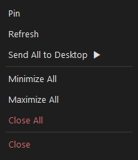

**What you're seeing.** Right-clicking the window list's **title bar** opens a second menu of
actions that apply to *every window* the panel is showing:

- **Pin** — pins the window list panel open (becomes *Unpin* when already pinned).
- **Refresh** — re-enumerates the windows on the desktop.
- **Send All to Desktop ▶** — moves every listed window to the next / previous / a new / a
  chosen desktop in one action.
- **Minimize All** / **Maximize All** — apply the state change to all listed windows.
- **Close All** — closes every listed window. It is drawn in **red** and **asks for
  confirmation first**; like single-window close it uses a graceful close, never a forced
  process kill.
- **Close** — closes the panel itself (this is the panel, not the windows).

**Where to configure / learn more.**
[Desktop Management](guides/desktop-management.md#title-bar-menu-whole-desktop-actions).

---

## The color picker

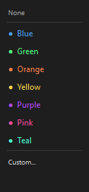

**What you're seeing.** The *Set Color* submenu for a desktop's accent color. Its entries:

- **None** — clears the desktop's accent color.
- **Seven named presets** — *Blue, Green, Orange, Yellow, Purple, Pink, Teal* — each shown with
  a colored dot so you can preview it.
- **Custom…** — lets you enter any `0xRRGGBB` hex color of your own.

The chosen color then appears as the row's bar in the [desktop list](#the-desktop-list-panel)
and, for the current desktop, as the [widget's](#the-taskbar-widget) color bar.

**Where to configure / learn more.**
[Coloring & Theming](guides/coloring.md#setting-a-color) and the `[DesktopColors]` section of
the [INI reference](configuration/ini-reference.md).

---

## The on-screen display (OSD)

**What you're seeing.** A brief translucent overlay that appears when you switch desktops, to
confirm where you landed. Here it reads `2: Code` — the default format is
`{number}: {name}`, so it shows the target desktop's number and label. It fades out on its own
after a short duration.

The OSD can stand in for Windows' own desktop-switch overlay (which the app can suppress), and
its text, position, size, opacity, and duration are all configurable.

**Where to configure / learn more.** The [OSD](#settings-osd-tab) tab, and
[How It Works](how-it-works.md#what-happens-when-you-switch) for where it fits in a switch.

---

## Toast notifications

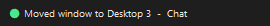

**What you're seeing.** A small, self-dismissing notification that confirms an action. It has:

- **A status dot** on the left, color-coded by kind — green for success (shown), plus
  info/warning/error colors for other events.
- **A message** describing what happened (`Moved window to Desktop 3 — Chat`).

Toasts appear for events you opt into — window moved, desktop created/deleted, window
pinned/unpinned, carousel toggled, update available, and so on — and fade out after a couple of
seconds.

**Where to configure / learn more.** Per-event toggles live on the
[Notifications](#settings-notifications-tab) tab.

---

## The Settings dialog

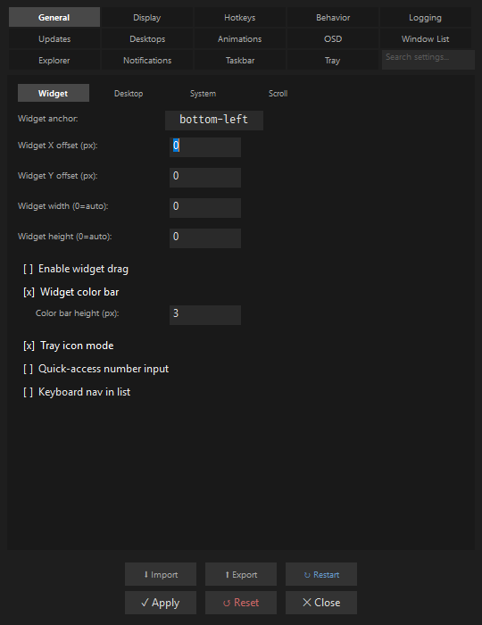

**What you're seeing (the frame).** Open Settings from the widget/tray menu or `Ctrl+Alt+S`.
Every tab shares the same frame:

- **The three-row tab bar** across the top — 14 tabs: *General, Display, Hotkeys, Behavior,
  Logging, Updates, Desktops, Animations, OSD, Window List, Explorer, Notifications, Taskbar,
  Tray*. The active tab is highlighted.
- **A search box** in the top-right corner (`Search settings…`) — see
  [Settings search](#settings-search).
- **Sub-tabs** under the tab bar on the busier tabs (the General tab's *Widget / Desktop /
  System / Scroll* row here) that split a tab into groups.
- **The button rows at the bottom** — top row **Import / Export / Restart**; bottom row
  **Apply** (write + apply live), **Reset**, and **Close**. *Apply* writes the whole
  configuration in one pass, so all tabs persist together.

Most changes take effect immediately; **Theme** and **Language** are applied at startup and say
so in the dialog. The tabs below are the ones this tour captures; the remaining tabs (Logging,
Updates, Animations, Explorer, Taskbar, Tray) follow the same layout.

### Settings: General tab

The screenshot above shows the **General → Widget** sub-tab. Its controls:

- **Widget anchor** — which of nine screen positions the widget docks to (`bottom-left`).
- **Widget X / Y offset (px)** — pixel nudges from that anchor.
- **Widget width / height (0 = auto)** — override the computed size.
- **Enable widget drag** — allow dragging the widget freely (off here).
- **Widget color bar** + **Color bar height (px)** — the accent strip and its thickness.
- **Tray icon mode** — run as a tray icon instead of an on-taskbar widget.
- **Quick-access number input** — double-click the number to type a desktop to jump to.
- **Keyboard nav in list** — move through the desktop list with the keyboard.

The *Desktop*, *System*, and *Scroll* sub-tabs hold navigation (wrap / auto-create), singleton
and startup options, and mouse-wheel behavior. See
[Configuration](configuration/index.md) and the [INI reference](configuration/ini-reference.md).

### Settings: Display tab

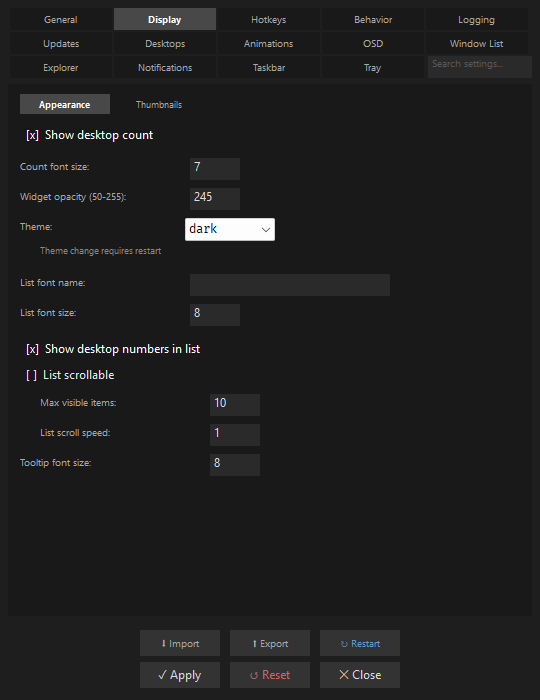

The **Display → Appearance** sub-tab controls how everything looks:

- **Show desktop count** + **Count font size** — the optional "1/6"-style counter and its size.
- **Widget opacity (50–255)** — the widget's translucency (`245`).
- **Theme** — the color scheme dropdown (`dark`); the note reminds you a theme change
  **requires a restart**.
- **List font name / List font size** — the desktop list's font.
- **Show desktop numbers in list** — the `01`/`02` prefixes in the desktop list.
- **List scrollable** + **Max visible items** + **List scroll speed** — scrolling behavior when
  you have many desktops.
- **Tooltip font size** — the size of hover tooltips.

A second **Thumbnails** sub-tab controls desktop hover previews. Deep dive:
[Coloring & Theming](guides/coloring.md#themes).

### Settings: Hotkeys tab

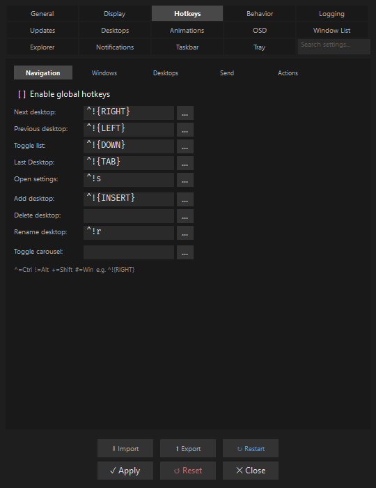

The **Hotkeys** tab is split into sub-tabs (*Navigation, Windows, Desktops, Send, Actions*). On
each row:

- **A label** names the action (Next desktop, Previous desktop, Toggle list, …).
- **A key field** shows the current binding in AutoIt syntax (`^!{RIGHT}` = Ctrl+Alt+Right).
- **The `…` button** captures a new chord for that action.
- **Enable global hotkeys** at the top is the master switch for all of them.
- **The legend at the bottom** (`^ = Ctrl  ! = Alt  + = Shift  # = Win`) decodes the syntax.

Any action left blank is simply unbound — it is still reachable from menus and the
[CLI](configuration/cli.md). Full list of actions and defaults:
[Desktop Management](guides/desktop-management.md#keyboard-shortcuts-and-mouse-wheel-navigation).

### Settings: Behavior tab

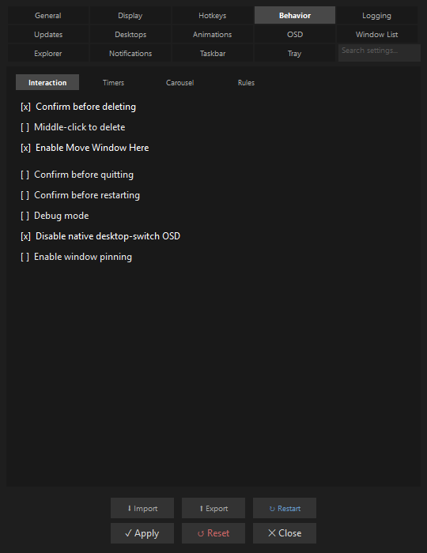

The **Behavior → Interaction** sub-tab gathers confirmation prompts and interaction switches:

- **Confirm before deleting** — ask before removing a desktop.
- **Middle-click to delete** — allow deleting a desktop by middle-clicking its list row.
- **Enable Move Window Here** — show the *Move Here* action in menus.
- **Confirm before quitting / restarting** — guard those actions with a prompt.
- **Debug mode** — extra logging/diagnostics.
- **Disable native desktop-switch OSD** — suppress Windows' own switch overlay.
- **Enable window pinning** — turn on the pin-window / pin-app actions.

The *Timers*, *Carousel*, and *Rules* sub-tabs hold polling intervals, carousel (auto-cycle)
options, and the window-rules engine toggle.

### Settings: Desktops tab

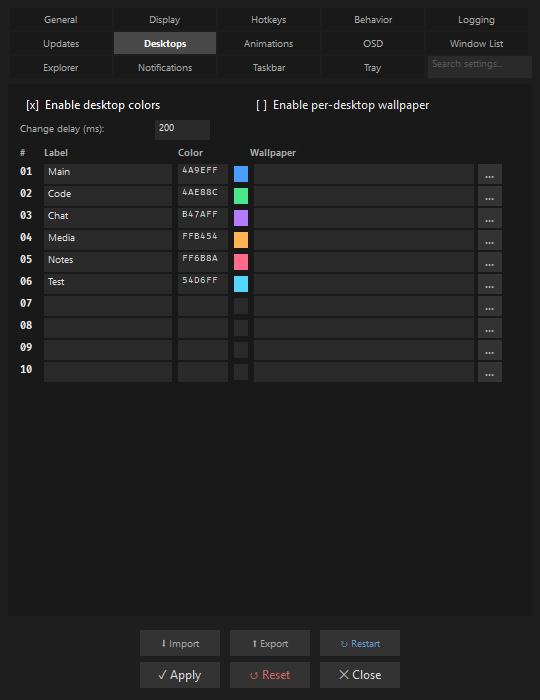

The **Desktops** tab is a table with one row per desktop (01–10):

- **Enable desktop colors** / **Enable per-desktop wallpaper** — the two master switches at the
  top, with a **Change delay (ms)** for the wallpaper swap debounce.
- **Label** — the desktop's custom name, editable inline.
- **Color** — the accent color as a hex value with a **live swatch** beside it.
- **Wallpaper** — an image path per desktop, with a **`…`** button to browse.

This is the one place to see and edit all desktops' names, colors, and wallpapers together.
Deep dive: [Coloring & Theming](guides/coloring.md).

### Settings: Window List tab

The **Window List** tab configures the [window list panel](#the-window-list-panel):

- **Enable window list** — the master switch.
- **Window scope** — `current` desktop only, or `all` desktops.
- **Panel position** / **Panel width** / **Max visible windows** — placement and sizing.
- **Show search bar** — the filter input in the panel.
- **Auto-refresh** + **Refresh interval (ms)** — how often the list re-enumerates.
- **Draggable window list** — allow dragging the panel to reposition it.

### Settings: Notifications tab

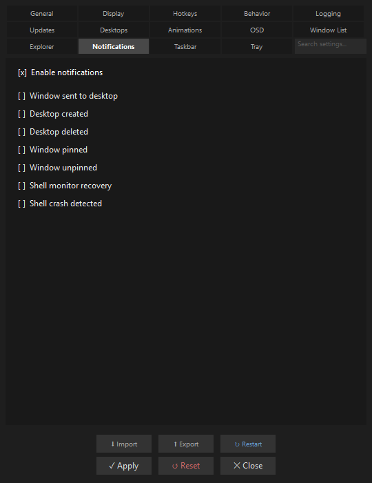

The **Notifications** tab decides which events raise a [toast](#toast-notifications):

- **Enable notifications** — the master switch.
- **Per-event toggles** — *Window sent to desktop, Desktop created, Desktop deleted, Window
  pinned, Window unpinned, Shell monitor recovery, Shell crash detected*.

The on-screen display options live alongside these settings and on the dedicated
[OSD](#settings-osd-tab) tab.

### Settings: OSD tab

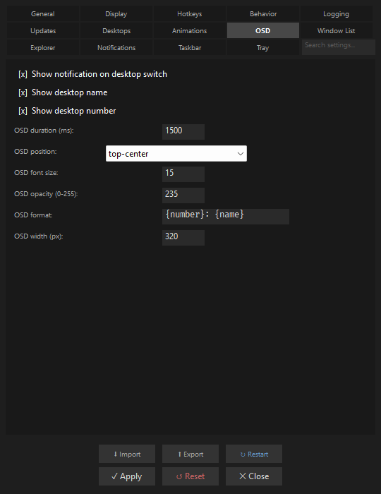

The **OSD** tab controls the [on-screen display](#the-on-screen-display-osd):

- **Show notification on desktop switch** — the master switch.
- **Show desktop name** / **Show desktop number** — what the overlay includes.
- **OSD duration (ms)** — how long it stays before fading.
- **OSD position** — where on screen it appears (`top-center`).
- **OSD font size** / **OSD opacity (0–255)** — its type size and translucency.
- **OSD format** — the template string (`{number}: {name}`) that builds the text.
- **OSD width (px)** — the overlay's width.

### Settings search

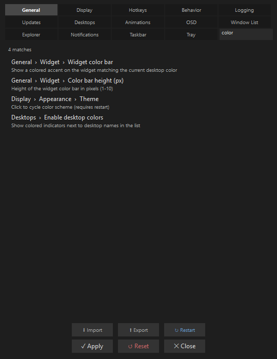

**What you're seeing.** Typing in the **search box** (top-right of any tab) filters *every*
setting across all 14 tabs and shows an overlay results panel. Here `color` matches four
settings. Each result shows:

- **A breadcrumb path** — `General › Widget › Widget color bar` tells you which tab and
  sub-tab the setting lives on.
- **A one-line description** under it — what that setting does.

**Clicking a result** jumps you straight to that control and briefly pulses it so you can spot
it. This is the fastest way to find a setting when you do not know which tab it is on.

**Where to configure / learn more.** [Configuration](configuration/index.md#the-settings-dialog).

---

## Update-check dialogs

Desk Switcheroo can check GitHub for newer releases. A manual check (from Settings or the
menu) runs through up to three dialog states.

**1. Checking.** While it contacts GitHub it shows a small, **cancellable** progress dialog:

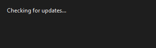

**2. Up to date.** If you already have the latest build, the result confirms it and offers
nothing to download:

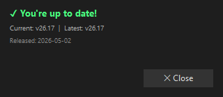

- **A green "You're up to date!" heading**.
- **A version line** — `Current: v26.17 | Latest: v26.17`.
- **A release date**, and a **Close** button.

**3. Update available.** If a newer release exists, the same dialog shows the new version and
offers a download:

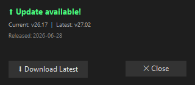

- **A green "Update available!" heading**.
- **The version comparison** — `Current: v26.17 | Latest: v27.02` — and the **release date**.
- **A "Download Latest" button** that fetches the portable ZIP (only if you click it), plus
  **Close**.

A failed check (no network, GitHub unreachable) does not pop an error — it is logged and the
temp file cleaned up.

**Where to configure / learn more.**
[Stability & Mitigations](reference/stability.md#update-check-failure-behavior) and the
[Updates] tab / `[Updates]` INI section.

---

## Tray menu

*Screenshot pending.* When Desk Switcheroo runs in **tray mode** (or with the tray icon
enabled), left- or right-clicking its notification-area icon opens a native Windows menu. It is
the tray-mode equivalent of the [desktop context menu](#the-desktop-context-menu) and offers
the same core actions — switch, edit label, add/delete desktop, open Settings, open About, and
Quit — with the exact entries controlled by the **Tray** Settings tab (`tray_menu_show_*`
keys). Because it is a native shell popup (not one of the app's own themed windows), it is not
captured here; the [desktop context menu](#the-desktop-context-menu) screenshot shows the same
set of actions.

**Where to configure / learn more.** The [Tray] tab (see
[Configuration](configuration/index.md)) and the `[Tray]` section of the
[INI reference](configuration/ini-reference.md).

## Crash dialog

*Screenshot pending.* If an unhandled error occurs, Desk Switcheroo writes a `crash_*.log` and
shows a standalone dark crash dialog built without the themed helpers (so it works even if the
theme state is corrupt). It offers four actions — **Copy Report**, **Open Log**, **Restart**,
and **Close**. It is only reachable by inducing an actual crash, so it is described rather than
shown here.

**Where to configure / learn more.**
[Stability & Mitigations](reference/stability.md#crash-recovery).

---

## Related pages

- [Getting Started](getting-started.md) — install and first run.
- [How It Works](how-it-works.md) — what a switch actually does.
- [Desktop Management](guides/desktop-management.md) — the widget, lists, and menus in depth.
- [Coloring & Theming](guides/coloring.md) — themes, accent colors, wallpapers.
- [Configuration](configuration/index.md) — the Settings dialog and INI file.
- [Advanced INI Reference](configuration/ini-reference.md) — every key behind these controls.
